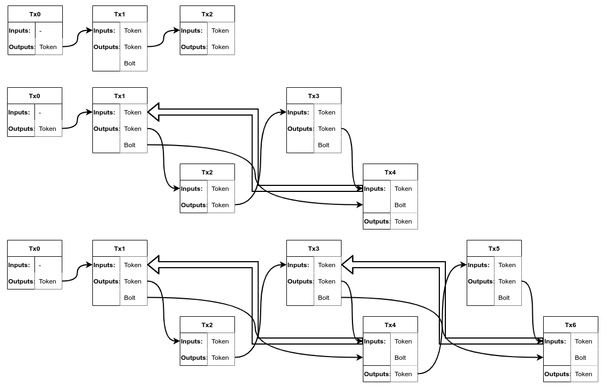
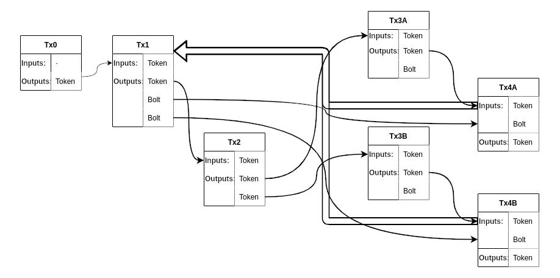
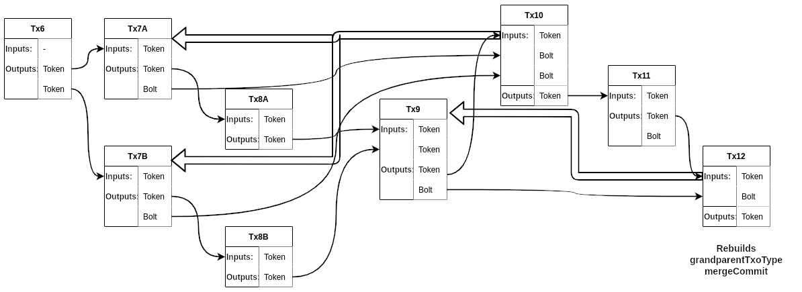

## Babbage BSV Hackathon 2025 entry


# Bitcoin Original Layer-1 Token Protocol
The BOLT protocol is the World's first Bitcoin token protocol which does not rely on a secondary database to authenticate token validity and identity unlike OMNI, Ordinals, and similar solutions. This innovation allows external system integration at the base blockchain layer as systems and tokens can now automatically rely upon the embedded token identities and interoperate.
The BOLT protocol uses a proof by mathematical induction to solve the back to genesis problem surrounding where a token was initially minted, the genesis transaction, and which issuing public key identifier authorised its creation.
Utilising multiple transaction inputs & outputs, specifically a new UTXO primitive nicknamed a 'Bolt', the protocol rules direct a chain of transactions from the genesis transaction onwards in such a way that a token cannot be counterfeited.

A whitepaper has been written outlining the details of this new primitive and the basic token protocol itself.

The BOLT protocol helps objectively demonstrate that Bitcoin SV (Satoshis Vision) only legitimate implementation of Bitcoin in the World as this protocol cannot be deployed on BTC Core due to SegWit along with missing OP_CAT & the rest of the disabled opcodes. The protocol, however, possibly could be emulated on other UTXO based blockchains such as Cardano possibly rendering its Layer-2 token solution (and thus, entire raison d'être) defunct! This Layer-1 protocol ought to also help highlight why the set of Layer-2 engineering endeavours such as Lightning, Taproot, Fractal et al are unneccessary.

Fixed value (non-fungible) & variable balance (fungible) token implementations are outlined, included & implemented here, with both using a shared set of basic rules & requirements.

Bolt protocol tokens are an improved way to issue currency as, unlike banknotes, they can not be counterfeited at all. The requirement of two transactions per transfer need not be considered a drawback as they can be broadcast simultaneously with the set of programs executing sequentially as one single action. Transaction validation is in-built into this library thus any user errors will always be caught never rendering a token unspendable. 

## Specification
- The protocol requirements are enforced primarily by the token script program aided via small subsidiary UTXO programs denoted "Bolts".
- Tokens and bolts each contain 1 Satoshi therefore an additional input and change output must be appended to pay mining fees to transport the token around in transactions.
- Tokens keep track of and pass onwards their issuance, genesis, parent & grandparent information as a record of their transactional history.
- Transfers (and indeed any other action in the case of fungible tokens e.g. splits, merges & swaps) occur by way of a pair of linked sequential transactions deemed the commit & settle transactions which are broadcast together simultaneously.
- To transfer a token from Alice to Bob, Alice is required to construct a commit transaction maintaining ownership of the token herself but grants ownership of a new bolt UTXO to Bob in the same transaction (Tx1 below).
- Alice then constructs the transfer settle transaction transferring ownership of the token to Bob (Tx2) broadcasting the commit & settle pair of transactions together.
- Bob then, wishing to transfer the token to Charlie, crafts a commit transaction where he transfers the Token to himself alongside a new bolt UTXO for Charlie (Tx3).
- Bob's bolt from Tx1 acts as a proof of that ancestral protocol transaction and is required to be consumed/spent alongside the token in the paired settle transaction (Tx4) in which Charlie is granted control of the token.
- The ancestral transaction (Tx1) is rebuilt in its entirety during the validation of Tx4, the existence of a token is confirmed and Tx1's txid is calculated and validated to be a part of the recorded transaction chain history.
- Thus, in order to forge a counterfeit token an attacker would necessarily be required to forge a previous ancestor transaction which is an impossibility as that would also need a previous forged ancestor and so on.
- To break a token, ending its lifecycle, one can provide a NULL script context (SigHashPreimage) indicating the intent to melt allowing the user to transfer the satoshi to any arbitrary locking script.
- Many tokens can be issued simultaneously in the same mint transaction limited in count only by Bitcoins 4 byte transaction outpoint index (4,294,967,295).
- Tokens always maintain a straight unbroken input to output chain of transactions back to their point of origin.

<figure>
  
  <figcaption>Evolution of a Token Chain of paired transaction transfers. Arrows travelling backwards indicate full ancestor tx rebuild/inspection along with the txid calculation/validating proof of existence.</figcaption>
</figure>


## Fungible Token Operations
Alongside the basic transfer mode of operation in the fungible token implementation exist other modes namely split, merge & swap. Token transactors can dictate which transactional operation is to be performed by supplying a variable `nextTxoType` byte. Historical txoTypes are can be inferred in order to rebuild the structure of ancestral transactions correctly. Each mode of operation has its own unique commit & settle execution flow, each of which operate slightly differently thus requiring transactions of varied structure & specific handling.
- Splits, merges & swaps are restricted to two tokens per pair of transactions.
- Fungible tokens are temporarily limited to contain a maximum balance of 2^53 - 1, or 9,007,199,254,740,991 units (Javascripts MAX_SAFE_INTEGER).
- Fungible tokens are also restricted from containing a negative balance but they can hold a zero value much like a bank balance.
- Multiple issuances from the same issuing authority can be made in multiple separate transactions so there is no maximum cap on total circulation.
- Each different operations varying requirements are enforced by the token program based on the user provided nextTxoType byte.
- Pairs of chosen operation transactions must be completed together e.g. only a transfer settle transaction can occur after a transfer commit transaction.
- Any operation commit transaction must follow a settle transaction of any kind.

### Split Balance
<figure>
  
  <figcaption>Splitting of a token directly from mint.</figcaption>
</figure>

- First, to reallocate some balance from a token, the amount to be subtracted and intended new recipients are recorded in the split commit transaction token output.
- Two bolt outputs for each of those recipients are included below the token in that same commit transaction (Tx1 above).
- A settle transaction is then created which allocates the division of balances into two new token outputs (Tx2).
- Each recipient now has control over two subsequent transaction outputs, a bolt and a token, which serve as proof of the unbroken chain of token transactions during the next chosen operation (Tx4A validates the ancestral token in Tx1 and consumes its first bolt).

### Merge Balances
<figure>
  
  <figcaption>Merging of two tokens.</figcaption>
</figure>

- To combine the balances of two tokens a merge operation can be performed.
- First, the merge commit transaction includes both tokens as inputs, each token is made aware of the others balance amongst other information.
- A single token output and a single bolt output are required to be created in the merge commit transaction.
- The first token input transfers its lineage into the single token output but special note of the second token inputs ancestral outpoint is recorded.
- A merge settle transaction is then constructed which uses the recorded ancestry values (and supplied additional data) to validate & rebuild both merging tokens ancestral transactions (Tx10 authenticates Tx7A & Tx7B) consuming a bolt from each.
- For security the protocol disallows the merging of any tokens without paired bolt outputs e.g. directly from their mint transaction.

### Swap/Exchange Currencies
<figure>
  
  <figcaption>A swap between two different tokens.</figcaption>
</figure>

- In order to exchange ownership of a pair of tokens minted by different issuers a swap operation can be performed.
- For simplicity, swap operations transfer ownership of the entire balance of both tokens between recipients.
- Exact exchange amounts can be negotiated and created in split operations beforehand.
- Each token is included as inputs in the swap commit transaction and are provided all information necessary to enforce two associated token outputs.
- Two bolt outputs, one per planned recipient, are also included in the swap commit transaction.
- Finally, in the swap settle transaction, the tokens are each transferred to the previously committed & opposite planned recipients.
- Both token programs input in the swap settle transaction perform a double rebuild & validation of each tokens claimed ancestor whilst ensuring a bolt is consumed from both.
- Like merge operations, the protocol requires each token included in the swap to have an associated bolt output (e.g. they both have previously been transferred beyond their mint transactions).

The BOLT protocol could have been deployed on Bitcoin back in 2009 & necessarily required the restorative "Chronicles" update of Q4-2024 to make use of the original protocols full featureset. Unless a script context is validated in the scriptSig it cannot be trusted when inspecting ancestral transactions in the future.

On the face of it the fungible example is a good replica of digital currency with inbuilt trading/bureau de change functionality. These implementations can be extended to incorporate additional on-demand consumable UTXOs to interface & interact with prospective blockchain systems.

The BOLT protocol represents a significant advancement in Bitcoin token technology, offering a more secure, efficient, and versatile solution for token management on the Bitcoin blockchain.

<!-- ### Demonstrations

```bash
npx ts-node demo.ts
``` -->

# Only on:
<figure>

</figure>